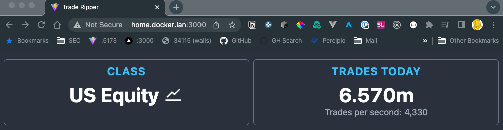

# Sipper Ripper CLI

## Danger here

This is a first stab (in Go) at doing this, so there a few untested things (who am I kidding - there are no tests).  I'd previously attempted this in Node.js with TimescaleDB as the database, but wasn't very successful (zombie sockets, slow client errors, crying, loss of bladder control, general suffering).  Go and QuestDB saved me.

**No guarantees - use it at your own risk.**

## What is this?

If you pay for
an [Alpaca Markets data subscription](https://alpaca.markets/docs/api-references/market-data-api/stock-pricing-data/realtime/)
have access to all trades going through
the [Securities Information Processor](https://polygon.io/blog/understanding-the-sips/).

This app captures all trades (not quotes or bars), and writes the *Symbol*, *Price*, *Size*, *Timestamp* and*tks* (crypto only) to
a [QuestDB](https://questdb.io/docs/) database. Fields such as trading conditions, exchange and tape are thrown away.

## Why QuestDB?

I tried a bunch of databases, SQLite, MongoDB (time series), Postgres, TimeScaleDB (postgres), but none were able to
perform as well as Quest with so little effort while being able to bulk insert and perform online queries at the same
time.

I run my QuestDB on Windows 11 Pro (yes, Windows) AMD 5700g with 64GB of RAM and a PCI gen 4 NVME drive, which is
limited to PCI gen 3 speed because of the processor, but still plenty of headroom.

I've also had it running on linux in docker without any issues.

If you do try running QuestDB in Docker on an Apple Silicon machine in Docker, at the time of writing, there is no native ARM image.  I did try it (my personal dev machine is an Apple Mac Studio M1 Max), but it slammed it pretty hard during peak load (market open and close).  Use
the [binary download instead or install it with brew](https://questdb.io/docs/get-started/homebrew).


### Installation

Following the instructions on [QuestDB's](https://questdb.io/docs/get-started/binaries/) website.

One other thing you will need to do if you want to perform near real-time queries is to change
the [commit lag](https://questdb.io/docs/guides/out-of-order-commit-lag/).

This is a high throughput scenario, so well commit at least every 1 second, or if we have reach 10,000 uncommitted rows.  When the market opens, you can easily hit 30,000 - 40,000 trades a second.

Open `server.conf` and add the following lines

```
cairo.commit.lag=1000
cairo.max.uncommitted.rows=10000
```

Restart the QuestDB.

## Monitoring

A web server is included.  The default port is `3000`, but the port can be changed using the `--webserver` CLI option.



## Current Trade

The web server provides an endpoint to get the latest price for any symbol.  Internally, a different database is used to store this information ([Badger](https://github.com/dgraph-io/badger)), so it doesn't burden the QuestDB server.

```bash
curl http://<your-host>:3000/trades/latest?symbols=AAPL,MSFT,NFLX,TSLA,IBM -H "Accept: application/json"
```

Example result

```json
{
  "AAPL": {
    "price": 135.99,
    "size": 500,
    "timestamp": "2022-11-07T14:52:01.829789677Z"
  },
  "IBM": {
    "price": 136.98,
    "size": 27,
    "timestamp": "2022-11-07T14:51:58.67002496Z"
  },
  "MSFT": {
    "price": 222.47,
    "size": 80,
    "timestamp": "2022-11-07T14:52:01.753318506Z"
  },
  "NFLX": {
    "price": 253.73,
    "size": 20,
    "timestamp": "2022-11-07T14:52:01.122098089Z"
  },
  "TSLA": {
    "price": 203.0499,
    "size": 1,
    "timestamp": "2022-11-07T14:52:01.873666143Z"
  }
}
```


## Build and Run

Build it, then run it, making sure that port is
the [Influx DB inline protocol](https://questdb.io/docs/develop/insert-data/#influxdb-line-protocol) port (default
is `9009`)

```bash
cd web && npm run build

go build

# for us equity quotes
./trade-ripper --host my.questdb.host --class us_equity --influx 9009 --postgres 8812 --webserver 3000 

# for crypto quotes
./trade-ripper --host my.questdb.host --class crypto --influx 9009 --postgres 8812 --webserver 3000

# using default values (influx 9009, postgres 8812, webserver 3000)
./trade-ripper --host my.questdb.host --class us_equity
```

## Performance

Peak network load was about 25Mb/s at the end of normal trading hours.

Insert performance is really the bottleneck.  Records are inserted every 1 second.  However, inserts using the Influx Inline Protocol happen in chunks of 1,000 at a time.  What you will find is that there may be a lag in data committing to the database at peak load times (market open and close).


